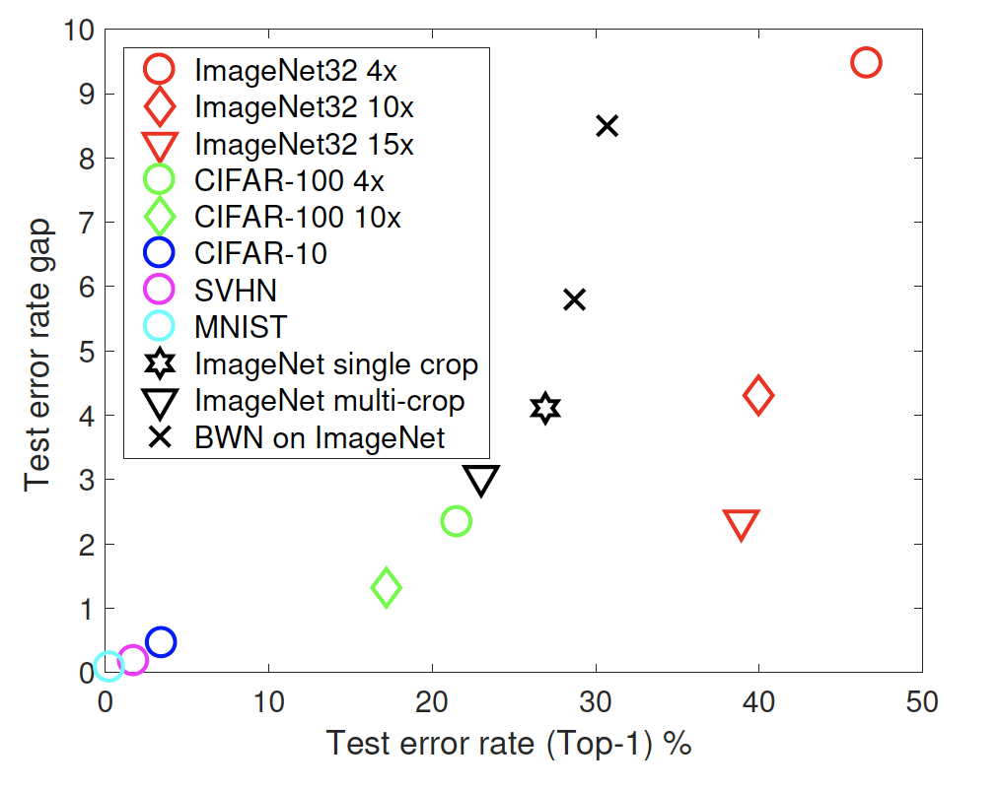
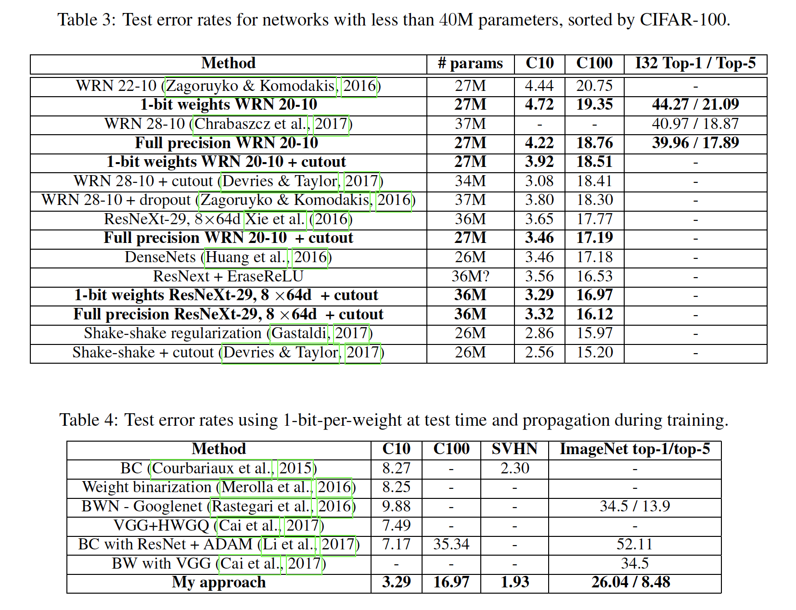

# Training wide residual networks for deployment using a single bit for each weight

Author: Mark D. McDonnell

This work was published in ICLR 2018 (iclr.cc). The ICLR version of the paper and the double-blind open peer review can be found at https://openreview.net/forum?id=rytNfI1AZ (download the PDF here: https://openreview.net/pdf?id=rytNfI1AZ ).

The paper is also on arxiv: https://arxiv.org/abs/1802.08530

The paper is also featured on paperswithcode.com:  https://paperswithcode.com/paper/training-wide-residual-networks-for

# Single-bit-per-weight deep convolutional neural networks without batch-normalization layers for embedded systems

Authors: Mark D. McDonnell, Hesham Mostafa, Runchun Wang, Andre van Schaik

This work was published at IEEE conferencs ACIRS 2019, held in Nagoya, Japan.

The paper is also on arxiv: https://arxiv.org/abs/1907.06916

---

Contact: mark.mcdonnell@unisa.edu.au

We provide in this repository code relevant to both papers that will enable the reader to verify our strong error rate results using a single-bit for each weight in inference, either when using batch normalisation layers, or replacing the combination of batch normalisation and ReLU with shifted ReLU.

At this point we have only provided CIFAR 10 and CIFAR 100 examples. One day if we get time, we will add ImageNet.

**Summary of Tensorflow.keras Results in this Repository**

All results in this table are for 20-10 Wide Resdual Networks, with ~26 million parameters

| Task      | Accuracy |
| ----------- | ----------- |
| CIFAR 10 Full Precision Baseline      | 96.62%       |
| CIFAR 10 1-bit-per-weight with batch norms   | 96.25%        |
| CIFAR 10 Full precision with shifted ReLU   | 95.66%        |
| CIFAR 10 1-bit-per-weight shifted ReLU   | 96.52%        |
| CIFAR 100 Full Precision Baseline      | 83.02%       |
| CIFAR 100 1-bit-per-weight with batch norms   | 81.83%        |
| CIFAR 100 Full precision with shifted ReLU   | 79.37%        |
| CIFAR 100 1-bit-per-weight shifted ReLU   | 78.41%        |

A noteable outcome is that for CIFAR 10, 1-bit-per-weight and shifted-ReLU is effectively as good as full precison with batch norm.

Versions include: 

1. tensorflow.keras (tensorflow 1.13, but also tested in tensorflow 2.1)
2. Matlab, using the matconvnet package (http://www.vlfeat.org/matconvnet/) (not for shifted ReLU networks)
3. pytorch (coming, but thanks @szagoruyko for re-implementation in pytorch: https://github.com/szagoruyko/binary-wide-resnet)

Key results:

Figure 1: Gap between 32 bit weights and 1 bit per weight CNNs:

